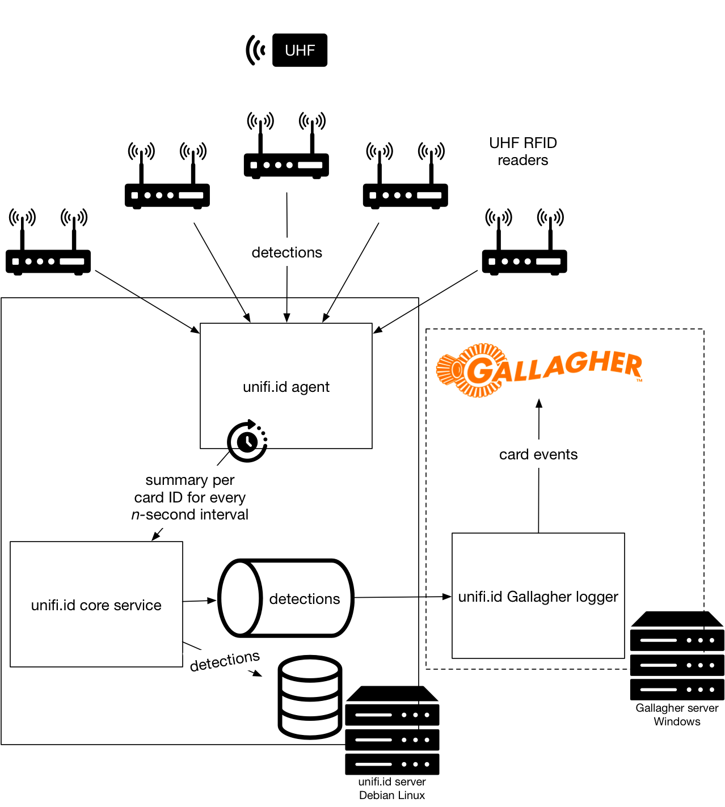

= unifi.id Gallagher Integration Operations Manual

== System overview

=== Business overview

Detects cards on UHF RFID readers placed around a site, and sends them to
Gallagher Command Centre to provide movement intelligence.

=== Technical overview

The system consists of UHF RFID readers with antennae connected to them, and
a single server running the unifi.id platform software (unifi.id core and
unifi.id agent) and a unifi.id Gallagher logger module.

The unifi.id server runs Debian 9.4+ Linux OS.

The system is designed to be run 24/7.

System requirements:

- Gallagher 7.80 with FTCAPI over DCOM configured
- All hardware (unifi.id server, readers) on one subnet, broadcasts allowed,
  static IPv4 addresses provided via DHCP.
- LAN should be isolated for security as reader payloads are not encrypted or
  authenticated.
- Bandwidth between readers and unifi.id server at least 1 Mbps per reader in
  both directions at all times.
- Minimum unifi.id server spec: dual-core Xeon, i7 or equivalent AMD CPU with
  8 MB cache, 32 GB RAM, 1 TB disk
- Remote SSH access to unifi.id server for maintenance.

TODO: supported readers & reader replacement process

=== Owner

====
*unifi.id* +
TODO: contact info here +
info@unifi.id
====

=== Contributing services and middleware

The server software depends on Java SE 10, PostgreSQL 9.5+ or 10.3+,
RabbitMQ 3.x, collectd.

=== Design

The server runs three unifi.id processes:

- *Agent*: Connects to configured readers, consumes detections, rolls them up
  into n-second time intervals, and sends them to the service.
- *Core service*: Consumes summary detections from the agent, persists them in
  the database, and posts them to a local MQ exchange for further processing.
- *Gallagher logger*: Consumes detections sent to the MQ exchange on the
  unifi.id server, sends them to Gallagher FTCAPI server represented as card
  events.

The following diagram illustrates the architecture of the system:

== System configuration

The system is shipped preconfigured for the readers on the site.
Unless a replacement server needs to be provisioned from scratch skip the next
subsection and go straight to "Gallagher Command Centre configuration".

=== Initial unifi.id server setup

TODO: Explain everything here assuming a ZIP package with the three JARs has
been provided. Don't forget to cover Gallagher side, agent, reader and zone
settings. Alternatively, provide instructions to bootstrap CFE.

=== Gallagher Command Centre configuration

==== FTCAPI and external systems

- Install FTCAPI according to instructions provided by Gallagher ensuring the
  test harness is working.
- Open regedit.
- Locate `HKEY_CLASSES_ROOT\AppID\{70C694E6-8A64-48B0-A58E-A7766C28B7C9}`.
- Create a `DllSurrogate` key inside with an empty value. This will enable
  FTCAPI communication over DCOM.
- Log into Gallagher Configuration Client.
- Go to "Window > External Systems".
- Right-click inside the "External Systems" window and create an
  "External System Server" setting its host name and port in the "Setup" section
  to where FTCAPI is running. Click "OK" to save.
- Right-click inside "External Systems" and create an "External System" with the
  following properties:
  * General > Name: `unifi.id`
  * API Setup > Controller: _(select a controller)_
  * API Setup > Server: _(select the previously created external system server)_
  * API Setup > Identity (Unique): `unifi.id`
- For each antenna on site right-click inside "External Systems" and create an
  external system item for each antenna on the site with the following
  properties:
  * General > Name: _(choose a friendly name)_
  * Setup > External System: `unifi.id`
  * Setup > Identification: `reader.<reader-serial-number>.<port-number>`, e.g.
    `reader.37017290281.1`
- The "External Systems" window should show the external system and its items as
  offline (red).

Warning: Do not edit external system items while the Gallagher logger is
running.

==== Adding a card type

- In Gallagher Configuration Client go to "Configure > Card Types".
- Right-click to create a new card type with the following properties:
  * Name: `UHF TID`
  * Facility Code: _(choose a facility code and remember it)_
  * Format: `Text`
  * Syntax: `^[0-9a-fA-F]{24}$`
- Add cards and assign them to cardholders as necessary.

=== Gallagher logger installation

- Copy the `unifi-gallagher-detection-logger` directory from the ZIP
  distribution to the FTCAPI machine.
- Configure by editing `run-gallagher-logger.bat` and setting the following
  system properties (`-D`):
  * FTCAPI configuration
  ** `-Dunifi.ftc.api.server=...`: IP address or hostname
  ** `-Dunifi.ftc.api.domain=...`: Windows domain
  ** `-Dunifi.ftc.api.username=...`: Windows login username
  ** `-Dunifi.ftc.api.password=...`: Windows login password
  ** `-Dunifi.ftc.api.facility.code=...`: Card event facility code
  ** `-Dunifi.ftc.api.event.type=...`: 0 for none; refer to FTCAPI manual for
     more details
  * `-Dunifi.service.api.uri=ws://(unifi.id-server-ip-address):8000/service/msgpack`
  * `-Dunifi.mq.endpoint=(unifi.id-server-ip-address):5672`

- Start the Gallagher logger by opening `run-gallagher-logger.bat`.

== Upgrading

=== Upgrading unifi.id

Software upgrades are provided and installed by unifi.id.

=== Upgrading Gallagher

- Stop the Gallagher logger. Detections will still be processed and queued on
  the unifi.id server.
- Upgrade Gallagher software and follow the "Gallagher Command Centre
  configuration" section above.

== Monitoring and alerting

Service and reader online/offline status is reported in Gallagher's
"External Systems" window. In addition, routine checks must be performed
regularly to discover potential issues as described in "Maintenance".

== System backup and restore

All permanent data including processed detections is stored in a PostgreSQL
database. Standard tooling shipped with PostgreSQL can be used to create full
database backups and restore from these.

=== Backup

----
pg_dump --username=unifi --dbname=unifi --format=custom > data.dump
----

Then copy the generated backup file using `scp` as required.

=== Restore

Before restoring the database stop the service and agent.

Warning: The following command will _overwrite_ all existing data.

----
pg_restore --clean --dbname=unifi data.dump
----

== Maintenance

=== Start and stop the Gallagher logger

Note: This will stop delivery of card events to Gallagher but detections from
readers will continue to be processed and queued on the unifi.id server.

Log into the Gallagher server and close the terminal window where the logger is
running.

=== Start and stop the system

- Log into the unifi.id server using SSH.
- Run `sudo systemctl stop unifi-agent` and `sudo systemctl stop unifi-service`.
- To start again run `sudo systemctl start unifi-agent` and
  `sudo systemctl start unifi-service`

=== Replacing a reader

TODO

=== Changing the roll-up interval

The agent on the unifi.id collects detections from reader in fixed n-second
intervals, and rolls them up into one detection per card per antenna in that
time interval to reduce the amount of data processing and storage. This can be
tweaked as necessary using standard PostgreSQL tooling:

- Log into the unifi.id server using SSH.
- Run `psql -U unifi -d unifi`.
- Run `select config->'rollup'->'intervalSeconds' from core.agent;` to show the
current interval in seconds.
- Choose a new interval. It must divide 86400 without a remainder. Common
choices include: 5, 10, 15, 20, 30, 60, 120.
- Update the interval (to 20 seconds):
`update core.agent set config = jsonb_set(config, '{rollup,intervalSeconds}', to_json(20)::jsonb);`.
- Exit `psql`.
- Restart agent: `sudo systemctl restart unifi-agent`.

=== Routine checks

To be performed at regular intervals (at least once a week) to ensure stability
of the system.

- In Gallagher:
  * Check that the unifi.id external system and all its items are online.
- On the unifi.id server:
  * `df -h /` to show free disk space
  * `sudo rabbitmqctl list_queues name messages_ready messages_unacknowledged`
  ** This will show the number of pending detections (`messages_ready`) and
  detections being processed (`messages_unacknowledged`).
  ** In normal operation all numbers should be in the low thousands or less. If
    this is not the case the system is likely underprovisioned and can't cope
    with the demand.
  * `sudo systemctl status unifi-agent` to show whether the agent is running
  * `sudo systemctl status unifi-service` to show whether the service is running
- On the FTCAPI server:
  * Check the Gallagher logger command prompt window for any error messages.

=== Purge unprocessed detections

If the Gallagher logger has been down or unable to send events to Gallagher and
the accumulated unprocessed detections are not required they can be deleted
before they are processed by running the following command on the unifi.id
server:

`sudo rabbitmqctl purge_queue integration.gallagher.logger`

== Troubleshooting

=== An external system item is showing up as offline

*Cause*: The reader isn't responding or some of its antennae are disconnected.

*Solution*: Check lights, kettle lead, reboot, etc. TODO [unifi.id]: fill in

=== An external system item is showing unknown status

*Cause*: The antenna in the system doesn't match.

*Solution*: Ensure the "Identification" string for the item is correct as
defined in "Gallagher Command Centre configuration" and follow the instructions
in the "Maintenance" section.

=== The unifi.id external system is showing as offline

*Cause*: The unifi.id Gallagher logger is failing to connect to FTCAPI or the
unifi.id server.

*Solution*: Ensure the Gallagher logger is running and read its console
output. Try restarting it. If the problem isn't fixed follow
"Maintenance > Routine checks" to find out the root cause restarting any failed
processes, and ensure the system is configured correctly according to the
"System configuration" section.

=== Low disk space on unifi.id server

*Cause*: Accumulated unprocessed detections or database backups (TODO: or journalctl/syslog logs?).

*Solution*: Use standard Unix tools to find and move/delete unnecessary files.
In the case of pending detections follow "Purge unprocessed detections".

== Report generation

CSV reports can be obtained from the unifi.id server database by using standard
PostgreSQL as follows:

- Log into the unifi.id server using SSH.
- Run `psql -U unifi -d unifi`.
- Run a select query on the `core.rfid_detection` wrapped in `COPY`:
  `COPY (SELECT * FROM core.rfid_detection WHERE ...) TO '/tmp/filename.csv' DELIMITER ',' CSV HEADER;`.
- Copy the generated CSV file using `scp` as required.

Warning: Running report queries will increase the load and may impact the
performance of the system. If in doubt, run report queries during off-peak
periods and monitor CPU, memory and I/O usage while the query is running.

=== Query examples

TODO

== TODO

- Onboarding?
- Figure out what we're doing about zones
- From Roy@Frontline:
* How do we test it to be sure it is successful?
* Rollback plan if unsuccessful?
